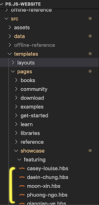
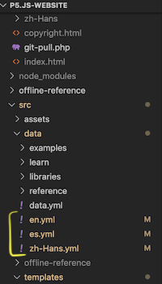
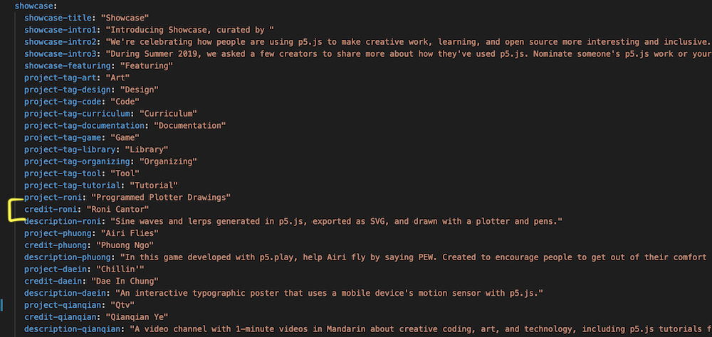
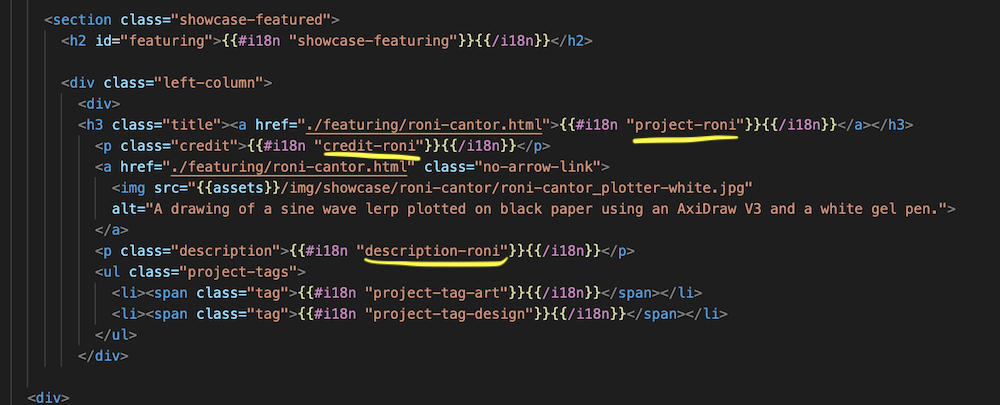

# Maintaining the p5.js Showcase Guide

The p5.js [showcase](https://p5js.org/showcase/) can be maintained in the following way. Currently, contributors can nominate themselves through this [form](https://docs.google.com/forms/d/e/1FAIpQLSdY76NtZaVqpGi-g6wKvhbnlqC3GhCl2TAJ5vgMN-CyStIItQ/viewform?usp=send_form) which is a apart of the p5.js google drive. If you wish to be the maintainer/co-maintainer for the showcase for the year, please email (insert email here) for further directions and access to the form results.

The current maintainer is: (insert name)
Past maintainers: (insert names), please contact them if you hav equestions!

The showcase information is hard coded in, that being said there is information that cannot be gained strictly from the form. The maintainer should email the nominee and have a q and a with them, which will also include getting any more relevant project links.

**The standard questions asked typically are:**
- What are you up to? 
- How did you use p5.js in this project? 
- What's your favorite p5.js feature?
- Did you face any challenges working on this project? 
- What's a cool thing we should check out? 
- Where can people learn more about you?

## Table of Contents

* [Setting up the Repo](#setting-up-the-repo)
* [Overall Understanding of the Structure](#overall-understanding-of-the-structure)
* [How to set up the YAML](#how-to-set-up-the-yaml)
* [How to add an entry](#how-to-add-pictures)
* [Finishing Up](#finishing-up)

## Setting up the Repo
Before adding to the p5.js showcase, make sure to follow the directions [here](https://github.com/processing/p5.js-website) which demonstrates how to copy the github repository to your machine. The git repository is the file makeup of the p5js website, so it includes all the handlebars files, css, html, yaml, json, GRUNT workers and everything that is used to construct it. 
In order to clone a git repo, make sure to open up terminal on your machine. To learn how to access files via terminal, view [this](https://www.dummies.com/computers/macs/mac-operating-systems/how-to-use-basic-unix-commands-to-work-in-terminal-on-your-mac/). If you don't have a mac, you can access the terminal via windows [here](https://www.microsoft.com/en-us/p/windows-terminal/9n0dx20hk701#activetab=pivot:overviewtab).
To edit the files you can use the code editor of your choice, for this tutorial I'm using Microsoft [Visual Studio Code](https://code.visualstudio.com/)

## Overall understanding of the structure
To access the showcase files, follow this [path](https://github.com/processing/p5.js-website/tree/master/src/templates/pages/showcase) or 

    p5.js-website > src > templates > pages > showcase

this shows where to access the handebars files in the cloned showcase.
The overall HTML template is a [handlebars](https://handlebarsjs.com/) file, which is basically a HTML file that has variable names which is then filled with information from [YAML](https://en.wikipedia.org/wiki/YAML) files which store text data.

**Locations of various specific files:**
- The main [Showcase page](https://p5js.org/showcase/) is ["index.hbs"](https://github.com/processing/p5.js-website/blob/master/src/templates/pages/showcase/index.hbs)
- Each [project feature page](https://p5js.org/showcase/featuring/roni-cantor.html) is under the ["featuring" folder](https://github.com/processing/p5.js-website/tree/master/src/templates/pages/showcase/featuring) as "creatorFirstName-lastName.hbs" (if a project has 1 creator) or "collaborator1FirstName-collaborator2FirstName.hbs" (if a project has multiple creators)



- Each file starts with this [YAML front matter](https://assemble.io/docs/YAML-front-matter.html) as metadata: title: showcase, slug: showcase/featuring/
- More information on YAML and how it relates to i18n can be seen [here](https://github.com/guillemontecinos/itp_fall_2018_open_source_studio/blob/master/final_project/i18n_contribution.md), basically i18n is how multiple language support is added and it's why the content for the website consists of handlebars (hbs files), and YAML (yml files).

**Note from Ashley (original showcase creator)**: In case you need more info on how to set up the "p5.js-website" GitHub repository locally on your computer (especially if you have more than 1 version of Node.js for some reason, I say try sticking to the [most current recommended version](https://nodejs.org/en/), here's a gist I [wrote](https://gist.github.com/kangashley/d2de58604f3cd81e7d85d6d9103198a5) up last summer. If you run into errors building the codebase locally with Node, feel free to address! I was there too, especially when it came to setting up internationalization/i18n.

## How to set up the YAML
The [YAML files](https://github.com/processing/p5.js-website/tree/master/src/data) exist under 

    p5.js-website > src > data 

and consist of en.yml, es.yml, and zh-Hans.yml. For now any data that is added to the en.yml can be added in the original untranslated text to the other yml files until it gets translated.



How the YAML works in conjunction with handlebars is basically that the content in YAML is organized into key value pairs. The keys, the font in blue are what are put into the handlebars file through the following format:

     {{#i18n "key"}}{{/i18n}}

Then these handlebars files are assembled into a HTML page with the value (orange in the YAML file).

**YAML File (key in blue, value in orange):**



**Handlebars File:**



## How to add a new entry
1. Create a new handlebars file by naming it "creatorFirstName-lastName.hbs" (if a project has 1 creator) or "collaborator1FirstName-collaborator2FirstName.hbs" (if a project has multiple creators)

2. Within that handlebars file, copy and paste the structure of other handlebars files

3. In index.hbs, add in a reference to the new handlebars file for that creator, do this in either the div left column or right column, the reference consists of an image, description, and title as seen by the html code below.
Replace all the parts that say creator name with creator's first and last name in the structure "firstname-lastname", **for example** for someone named John Smith it would be project-john-smith.

```
<h3 class="title"><a href="./featuring/creatorname.html">{{#i18n "project-creatorname"}}{{/i18n}}</a></h3>
        <p class="credit">{{#i18n "credit-creatorname"}}{{/i18n}}</p>
        <a href="./featuring/creatorname.html" class="no-arrow-link">
        
        </a>
        <p class="description">{{#i18n "description-creatorname"}}{{/i18n}}</p>
        <ul class="project-tags">
        <li><span class="tag">{{#i18n "project-tag-art"}}{{/i18n}}</span></li>
        <li><span class="tag">{{#i18n "project-tag-design"}}{{/i18n}}</span></li>
        </ul>
```

In conjunction with this step in the YAML file, add the necessary key value pairs under showcase.
**For example** for John Smith's Example Project it would be

    project-john-smith: "Example Project"

4. Add Images defined through {{assets}}
- Name project images are named firstname-lastname_projectName.jpg added to [p5.js-website>src>assets>img>showcase](https://github.com/processing/p5.js-website/tree/master/src/assets/img/showcase)
- In index.hbs and creatorFirstName-lastName.hbs, the image tag includes the {{assets}}/img/showcase/creatorFirstName-lastName.jpg/png/other image file extension, followed by an alt="image description" attribute.
- The alt image descriptions are necessary for accessibility/a11y because that's what screen readers scan. Here's a good guide by [Shannon Finnegan](https://www.eyebeam.org/alt-text-as-poetry/) and [Sina Bahram](https://pac.bz/projects/the-coyote-project/).
**For Example**: [line 29 of index.hbs](https://github.com/processing/p5.js-website/blob/master/src/templates/pages/showcase/index.hbs#L29)

```
{{assets}}/img/showcase/roni-cantor/roni-cantor_plotter-white.jpg" alt="A drawing of a sine wave lerp plotted on black paper using an AxiDraw V3 and a white gel pen.">
```

5. Continue updating the YAML partials that are used in "[en.yml](https://github.com/processing/p5.js-website/blob/master/src/data/en.yml#L689)", "[zh-Hans.yml](hhttps://github.com/processing/p5.js-website/blob/master/src/data/zh-Hans.yml#L689)", and "[es.yml](https://github.com/processing/p5.js-website/blob/master/src/data/es.yml#L689)".
- Every line in Showcase has been set up as .hbs file that containes partials of each "line" of copy/text you want translated in the double curly braces

    {{#i18n "variable-name"}}{{/i18n}}

- Each "variable-name" must be **unique** and is defined after line 689 in "en.yml", "es.yml", and "zh-Hans.yml".

- You must make sure the variables are defined on the same line across all 3 files, there will be errors otherwise. Since translations can be contributed later, you can use the English version as placeholder text in the other .yml files for now.

**For Example**: {#i18n "showcase-title"}}{{/i18n}} in "index.hbs" is currently defined in line 690 as showcase-title: "Showcase" in "en.yml", showcase-title: "Showcase" in "es.yml", and showcase-title: "Showcase" in "zh-Hans.yml".

## Finishing Up
Submit a [pull request](https://github.com/processing/p5.js/blob/master/contributor_docs/preparing_a_pull_request.md) titled "Showcase Update - (insert date)". It will be reviewed and then approved! 

Credits to Ashley Kang for helping in this documentation!